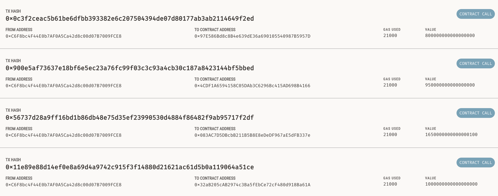
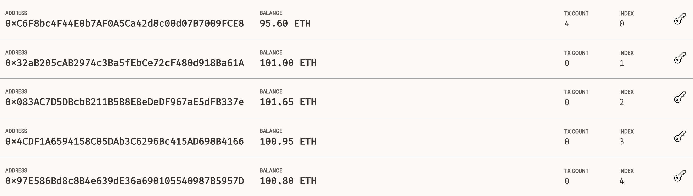

# Crypto-devs-webapp
A draft web application, built to demonstrate how hiring freelance crypto developers might look. The w3 crypto account is generated from a mnemonic, in this instance a ganache local host was used to provide blockchain functionality and testing ETH. The unit conversions, hashing, and transaction detils are mostly handled by the w3 python package. The front end was built using the streamlit python package.

## Ganache
ganache allows the developer to test and validate transactions on a locally hosted test blockchain. Test transactions have been sent to each of the hypothetical developers via the webapp.

---

wallet addresses confirm the ETH balance after transactions have been sent.

